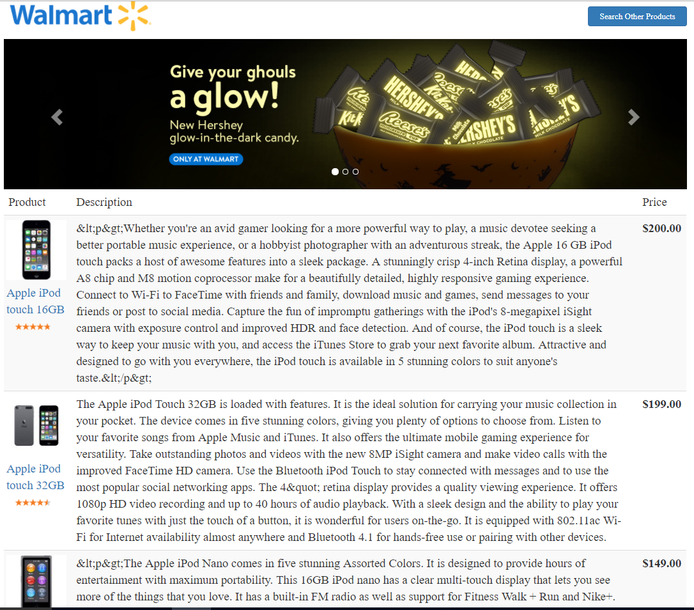

### Getting started

Install **node.js**. 

Install **gulp** and **bower**.

    $ npm -g install gulp bower

After that, check out the **Walmart-Assignment** project from git and run the following commands from the root folder: 

    $ npm install
    $ bower install
    $ gulp serve

You are now ready to go, your application is available at **http://127.0.0.1:3000**.

**Every file you add, edit or delete into the `/client` folder will be handled by the build system**.

### Directory Structure

* `build/` - Build files and configuration, the most important files to note are `build.config.js`, `protractor.config.js` and `karma.config.js`. These files are the heart of the build system. Take a look.
* `client/` the source code and tests of your application, take a look at the modules in this folder, you should structure your application following those conventions, but you can choose another convention as well.
* `.bowerrc` - the bower configuration file. This tells Bower to install components in the `client/src/vendor` directory.
* `.jshintrc` - JSHint configuration.
* `gulpfile` - see [The Build System](#thebuildsystem) below.
* `bower.json` - Contains the list of bower dependencies.
* `package.json` - node.js dependencies.

### A description of available tasks:

* **gulp serve** - The Application is up and running for you to access at port 3000. -- http://localhost:3000/#/search

* **Sample Search Screen Shot:**

* **Sample Results Screen Shot:**

* **Sample Recommendations Screen Shot:**

TO look at both the web app and the documentation, stop gulp serve and do gulp default:
* **gulp default** - With this task, you have the application running at port 3000 and documentation at port 8000.  -- http://localhost:8000/api

* **Sample Documentation Screen Shot:**

* **gulp test:unit** - For running unit tests. 
and you can also check the code coverage percentage once run "gulp test:unit" task at -- Walmart_Assignment/client/test/unit-results/coverage/PhantomJS 1.9.8 (Windows 8 0.0.0)/index.html

* **Sample Code Coverage Screen Shot:**

